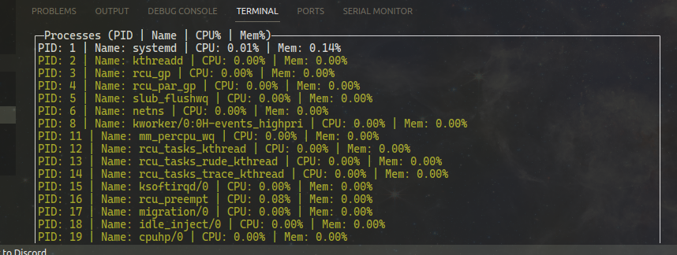

# Ubuntu Go Task Manager 🚀


Developed out of necessity on a low-spec machine, this Ubuntu Task Manager is a lifesaver for when IntelliJ—or any application—decides to crash without properly exiting. No more restarting the whole PC or digging through processes manually. It's a simple, terminal-based solution for efficiently managing and killing unresponsive tasks. Perfect for anyone seeking to streamline their workflow and keep their focus on coding, not on closing stubborn programs.
    

## 🎉 Features

- **Process Management:** View and close running processes just by pressing a key.
- **Resource Usage Insights:** Detailed insights into which processes are consuming the most resources.
- **User-friendly Interface:** A clean and intuitive text-based interface.
- **Lightweight & Efficient:** Built with Go for speed and low resource consumption.

## 📸 Screenshots





## 🚀 Installation

```bash
# Clone the repository
git clone https://github.com/Arinonia/UbuntuGoTaskManager.git

# Navigate to the project directory
cd UbuntuGoTaskManager/

# Build the project (make sure Go is installed)
go build

# Run the task manager
./ubuntu-task-manager
```